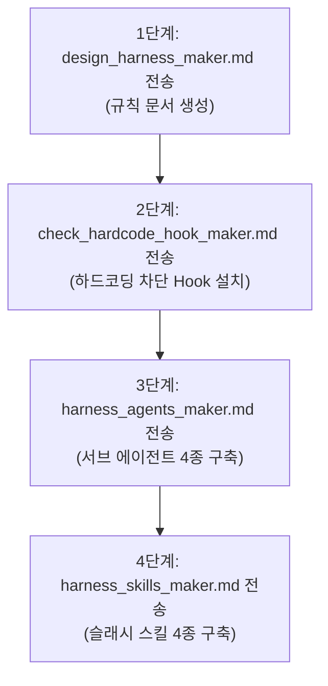

# [설명본] 하네스 엔지니어링 템플릿 사용 가이드 (`설명본.md`)

---

## 1. 파일명 / 역할 및 기능

| 파일명 | 역할 및 기능 |
| --- | --- |
| [**`design_harness_maker.md`**](file:///Z:/0_AI/0.%20GPT/project/design_harness_maker.md) | **[디자인 하네스 규칙 생성]** AI 에이전트에 전송 시 현재 프로젝트의 스택(React, Vue, Next.js, HTML, Tailwind 등)을 분석하여 규칙 본체(`design-system-harness.md`) 및 세션 가이드(`PROJECT_RULES.md`)를 자동 작성해 줍니다. |
| [**`check_hardcode_hook_maker.md`**](file:///Z:/0_AI/0.%20GPT/project/check_hardcode_hook_maker.md) | **[하드코딩 차단 Hook 구축]** 코드 편집(Edit/Write/MultiEdit) 직전에 하드코딩 색상, 임의 단위, arbitrary class, 비허용 CDN을 자동 검사하여 차단하는 Hook 스크립트(`check-hardcode.mjs`) 및 `settings.json`을 자동 구축해 줍니다. |
| [**`harness_agents_maker.md`**](file:///Z:/0_AI/0.%20GPT/project/harness_agents_maker.md) | **[서브 에이전트 4종 구축]** 역할과 권한(읽기 전용 vs 수정 가능)이 엄격히 분리된 4개의 독립 서브 에이전트(`figma-implementer`, `token-guardian`, `section-builder`, `design-reviewer`) 마크다운 파일을 자동 생성해 줍니다. |
| [**`harness_skills_maker.md`**](file:///Z:/0_AI/0.%20GPT/project/harness_skills_maker.md) | **[슬래시 커맨드 스킬 구축]** 사용자가 슬래시 커맨드로 에이전트를 직관적으로 실행할 수 있는 스킬 4종(`skills/*/SKILL.md`) 및 공통 분석 유틸리티(`extract-common.js`)를 자동 세팅해 줍니다. |

---

## 2. 실전 활용 워크플로우 가이드

### 🚀 [초기 셋업] 4단계 하네스 자동 구축 순서
어떤 프로젝트에서든 아래 순서대로 각 메타 프롬프트 파일의 내용을 복사하여 AI 에이전트에 전송하면 5분 안에 하네스가 세팅됩니다.

---

### 💻 [일상 개발] 하네스 기반 3단계 개발 프로세스
하네스가 구축된 프로젝트에서 코딩할 때 아래 3단계를 거치면 일관된 디자인 시스템과 최고 수준의 코드 품질이 유지됩니다.

$$\text{1단계: 구현 (/figma-to-section 또는 /new-section)} \longrightarrow \text{2단계: 토큰 정돈 (/sync-tokens)} \longrightarrow \text{3단계: 최종 검사 (/review-design)}$$

1. **1단계 (구현)**: `/figma-to-section` 또는 `/new-section` 명령어를 실행하여 원하는 UI 구현
2. **2단계 (토큰 동기화)**: `/sync-tokens` 명령어를 실행하여 추가된 수치를 토큰 선언부에 동기화
3. **3단계 (품질 검사)**: `/review-design` 명령어를 실행하여 5대 규칙 준수 여부 검사 ➔ **PASS 확인 후 완료!**

---

## 3. 슬래시 커맨드 스킬명 / 역할 및 기능

| 슬래시 커맨드 스킬명 | 호출 에이전트 | 역할 및 기능 상세 |
| --- | --- | --- |
| **`/figma-to-section`** | `figma-implementer` | **[Figma 시안 기반 구현]** Figma 시안 URL과 대상 위치를 전달받아 `Clarify → Reuse → Implement → Evaluate` 4단계를 거쳐 시안을 하네스 규칙 코드로 정교하게 구현합니다. |
| **`/new-section`** *(또는 `/new-component`)* | `section-builder` | **[토큰 기반 UI 생성]** Figma 시안 없이 기존 선언된 디자인 토큰만 활용하여 요청받은 영역/컴포넌트 1개만 격리 작성합니다. (토큰에 없는 값 사용 안 함) |
| **`/sync-tokens`** | `token-guardian` | **[하드코딩 탐지 및 토큰 동기화]** 코드에 직접 적힌 임의 수치를 탐지하여 토큰 선언부에만 안전하게 추가하고, 원본 코드에서 교체해야 할 파일/라인/추천 토큰명 목록을 출력합니다. |
| **`/review-design`** | `design-reviewer` | **[하네스 규칙 자동 검사 (읽기 전용)]** 코드를 고치지 않고 읽기 전용으로 5가지 항목(하드코딩 잔재, 토큰 참조, 허용 CDN, 접근성, 시안 일치)을 검사하여 PASS/FAIL 및 조치 스킬을 알립니다. |
